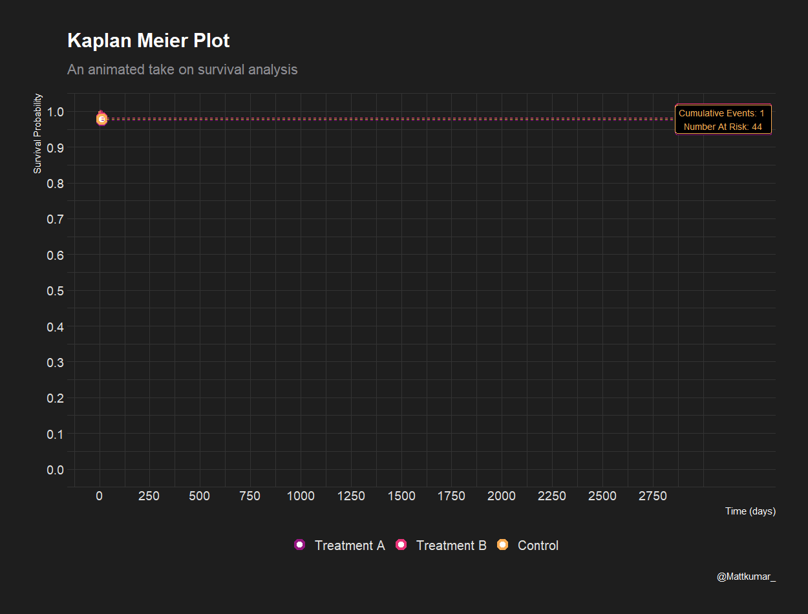
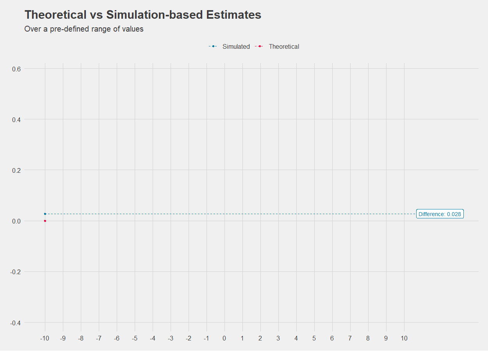

# tte_animations
Animated Kaplan-Meier curves 

## tte_animation.R

This program creates an animated Kaplan-Meier curve in gif format. 

## simulation.R

This program creates an animated "Theoretical vs Simulation-based Estimates" curve in gif format. 

